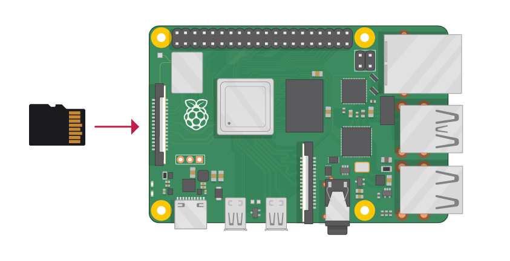
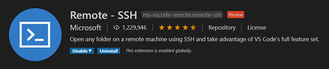
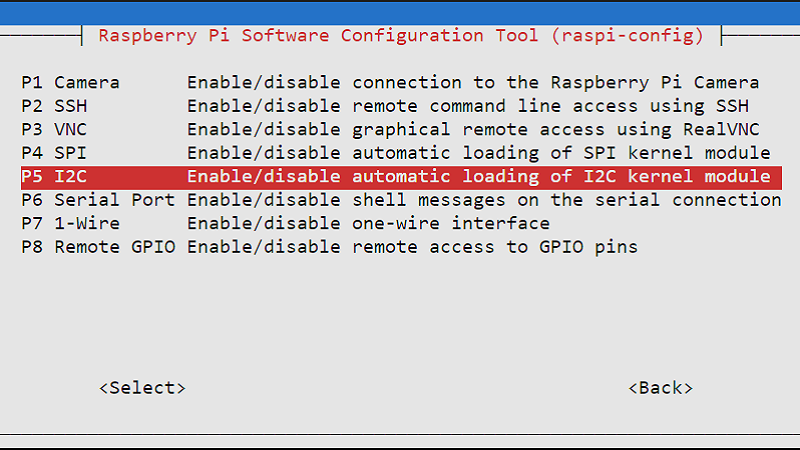
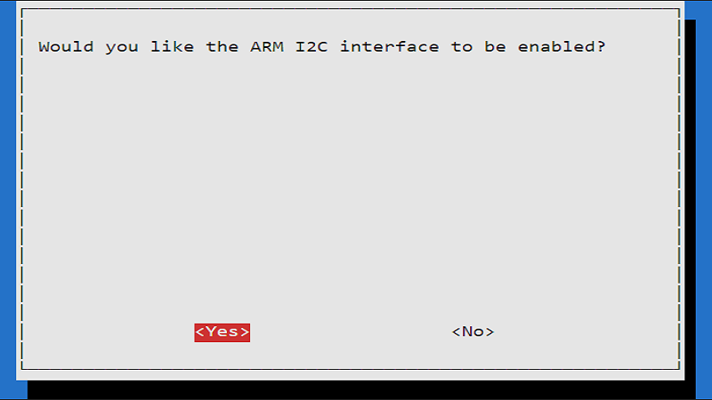
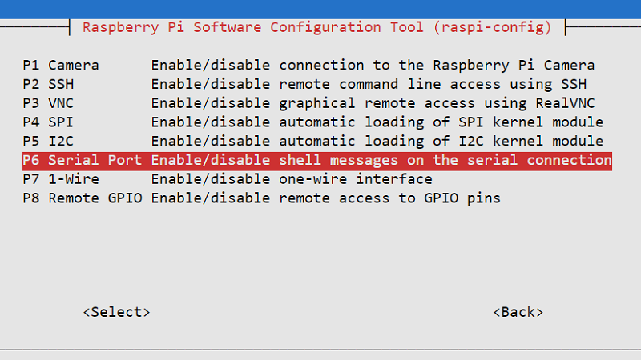

# RefriderationMonitor Integration for Azure IoT Central


The Refrideration Monitor project is an end to end for connecting a Raspberry Pi with the following features to Azure IoT Central...
* Capture Ambient Temperature and Humidity
* Protocol Transalation from a Serial Interface that Emits Battery, Solar and Container Properties
* Registration and Provisioning with Azure IoT Central
* Telemetry Sent to the Cloud
* DTDL Complex Device Modeling
* Visualizations

## Contents
- [RefriderationMonitor Integration for Azure IoT Central](#RefriderationMonitor-integration-for-azure-iot-central)
  - [Contents](#contents)
  - [Bill of Materials for Refrideration Monitor Monitoring](#bill-of-materials-for-cold-hub-monitoring)
      - [Components](#components)
      - [Tools](#tools)
      - [Optional](#optional)
    - [Raspberry Pi Model 4 B](#raspberry-pi-model-4-b)
    - [AM2315 Temperature and Humidity Sensor](#am2315-temperature-and-humidity-sensor)
    - [Ultra Compact RS232 to TTL Converter with Female DB9](#ultra-compact-rs232-to-ttl-converter-with-female-db9)
    - [Screw Terminal Block Breakout Module for Raspberry Pi](#screw-terminal-block-breakout-module-for-raspberry-pi)
    - [SanDisk Ultra microSD Card](#sandisk-ultra-microsd-card)
    - [USB to RS232 Serial Cable with Prolific PL2303 Chip](#usb-to-rs232-serial-cable-with-prolific-pl2303-chip)
    - [RGB LED 10mm (Optional Status Indicator)](#rgb-led-10mm-optional-status-indicator)
  - [Assembling the Raspberry Pi and the Components](#assembling-the-raspberry-pi-and-the-components)
    - [Soldering the Connection to the TTL Converter](#soldering-the-connection-to-the-ttl-converter)
    - [Soldering and Wiring the LED](#soldering-and-wiring-the-led)
    - [Shrink Wrap the LED](#shrink-wrap-the-led)
    - [Attach the Sensors](#attach-the-sensors)
    - [Connections](#connections)
    - [Device Assembly Overview](#device-assembly-overview)
  - [Setting up your Raspberry Pi OS](#setting-up-your-raspberry-pi-os)
    - [Setting up Raspberry Pi Imager](#setting-up-raspberry-pi-imager)
    - [Enabling Options for Connectivity (NO DISPLAY OR KEYBOARD/MOUSE)](#enabling-options-for-connectivity-no-display-or-keyboardmouse)
      - [Enable ssh to allow remote login](#enable-ssh-to-allow-remote-login)
        - [Mac instructions (enable ssh)](#mac-instructions-enable-ssh)
        - [Windows instructions (ssh)](#windows-instructions-ssh)
      - [Add your WiFi network info](#add-your-wifi-network-info)
        - [Mac instructions (wifi settings)](#mac-instructions-wifi-settings)
        - [Windows instructions (wifi settings)](#windows-instructions-wifi-settings)
    - [Eject the Micro SD card](#eject-the-micro-sd-card)
    - [Install the Micro SD card in the Raspberry Pi](#install-the-micro-sd-card-in-the-raspberry-pi)
  - [Setting up the Development Toolchain for your Workstation](#setting-up-the-development-toolchain-for-your-workstation)
    - [Install Git](#install-git)
    - [Install Visual Studio Code](#install-visual-studio-code)
    - [Install Python](#install-python)
    - [Upgrading pip](#upgrading-pip)
    - [Install all the Tools for Visual Studio Code](#install-all-the-tools-for-visual-studio-code)
  - [Connecting to the the Raspberry Pi (SSH)](#connecting-to-the-the-raspberry-pi-ssh)
    - [Connecting the Pi with a Monitor, Keyboard and Mouse](#connecting-the-pi-with-a-monitor-keyboard-and-mouse)
    - [Connecting Headless (no display)](#connecting-headless-no-display)
    - [Connecting to the Raspberry Pi using SSH](#connecting-to-the-raspberry-pi-using-ssh)
  - [Configuring the Raspberry Pi](#configuring-the-raspberry-pi)
    - [Default to Python 3](#default-to-python-3)
    - [Configuring I2C](#configuring-i2c)
    - [Installing Kernel Support (with Raspi-Config)](#installing-kernel-support-with-raspi-config)
    - [Bring down this Repository to the Raspberry Pi](#bring-down-this-repository-to-the-raspberry-pi)
    - [Install all the Packages](#install-all-the-packages)
    - [Testing and Verifying I2C](#testing-and-verifying-i2c)
  - [Azure IoT Central Device Connectivity using KeyVault (OPTIONAL)](#azure-iot-central-device-connectivity-using-keyvault-optional)
    - [Create our Connection Secrets...](#create-our-connection-secrets)
    - [Get Your Credentials for Azure Login](#get-your-credentials-for-azure-login)
    - [Configuring the Secrets and Retreival from Key Vault!](#configuring-the-secrets-and-retreival-from-key-vault)
  - [Azure IoT Central Device Connectivity for Local Development](#azure-iot-central-device-connectivity-for-local-development)
    - [Create our Local Configuration File Connection Secrets](#create-our-local-configuration-file-connection-secrets)
  - [Provisioning our Our Refrideration Monitor Device in Azure IoT Central](#provisioning-our-our-cold-hub-device-in-azure-iot-central)
    - [The Refrideration Monitor as a Device is Provisioned!](#the-cold-hub-as-a-device-is-provisioned)
  

## Bill of Materials for Refrideration Monitor Monitoring
The following are needed for this project...
#### Components
* One(1) Raspberry Pi Board (version 4)
* One(1) AM2315 Temperature and Humidity Sensor
* One(1) Ultra Compact RS232 to TTL Converter with Female DB9
* One(1) Screw Terminal Block Breakout Module for Raspberry Pi
* One(1) SanDisk Ultra microSD Card
* One(1) USB to Serial Cable
* Four(4) Wires (1 foot each in length) for connecting the RS232 to TTL Converter
* One(1) RGB Led (Optional)
* Three(3) 270 ohm resistor
* Four(4) Wires (1 foot each in length) for connecting the RGB Led
#### Tools
* Soldering Iron or Soldering Station
* Solder
* Small Flat Head Screwdriver
* Network Cable
#### Optional
* Monitor or Raspberry Pi Touchscreen
* Keyboard
* Mouse
### Raspberry Pi Model 4 B


The speed and performance of the new Raspberry Pi 4 is a step up from earlier models. For the first time, we've built a complete desktop experience. Whether you're editing documents, browsing the web with a bunch of tabs open, juggling spreadsheets or drafting a presentation, you'll find the experience smooth and very recognisable — but on a smaller, more energy-efficient and much more cost-effective machine.
### AM2315 Temperature and Humidity Sensor


This sensor contains a thermistor temperature sensor and a capacitive humidity sensor. A small microcontroller inside does the readings and provides a simple I2C interface for reading the finished & calibrated output data. Especially nice is that this sensor is in a rugged case with mounting bracket, which makes it way superior to a normal PCB-mounted sensor.

While it is not rated as 'weatherproof', this sensor would do much better for sensing where there might be wind, rain, zombies, etc. than SHT PCB-breakout sensors, and the i2c interface makes it easier to interface with microcomputers that can't do the delicate timing of the DHT sensors.
### Ultra Compact RS232 to TTL Converter with Female DB9


This adapter helps to convert TTL (Transistor-Transistor Logic) level signals to RS-232 interface. This converter has a Female DB9 connector.
### Screw Terminal Block Breakout Module for Raspberry Pi


The Pi Screw Terminal Breakout is the perfect way to connect to the power and signal pins on your Raspberry Pi. It breaks out all 40 pins of the GPIO header to easily accessible and secure screw terminal blocks with labels for each pin function. There’s even a prototyping area for adding circuits or ICs, like level shifters, debounce circuits, or LEDs for example.
### SanDisk Ultra microSD Card


This is the SD card you will load the Raspberry Pi operating system onto and place into the Raspberry Pi board.
### USB to RS232 Serial Cable with Prolific PL2303 Chip


This is the cable we will use to emulate the serial telemetry data from the RefriderationMonitor Serial connection. It is a USB to RS232 Serial Cable with Prolific PL2303 Chip that we will plug into the Raspberry Pi and emit out a CSV string that we will parse, format into Json and send to Azure IoT Central.
### RGB LED 10mm (Optional Status Indicator)


The use of a RGB LED is a very useful way to indicate status through a visual color. Setting the LED to RED indicates that the operator should investigate the issue (as an example).

## Assembling the Raspberry Pi and the Components
In this section we will walk through the steps to assemble the boards, add the hat and attach all of the sensors so that we have a working IoT device for our coding and testing.

### Soldering the Connection to the TTL Converter

The first task is to solder wire connectors for our "RS232 to TTL Converter" that connect the serial output of the Refrideration Monitor and gather telemetry. I am showing using for colored wires to make the differentiation between...

* GND - Ground (Black Wire)
* TX - Transmit (Green Wire)
* RS - Receive (Orange Wire)
* VCC - DC Power (Red Wire)

<b>Note:</b> You are welcome to use any colors you want, but I will refer to these specific colors when we wire and test.

Solder the wires to the board and strip around 1/4 inch of bare wire on the connection end for attaching to the Screw Terminal Block Breakout Module.


### Soldering and Wiring the LED

### Shrink Wrap the LED
I highly recommend that you shrink wrap all exposed wire and connections so that you do not risk shorting out anything and most importantly, do not blow up a GPIO connection on the Raspberry Pi.


### Attach the Sensors
Now let's attach the our Serial Convertor and AM2315 Temperature and Humidity Sensor to the Screw Terminal Block Breakout Module.

<b>IMPORTANT</b> Always turn off the power to your Raspberry Pi whenever you are making connections to the Screw Terminal Block!


### Connections
| Sensor | Use | Wire Color  | Terminal Connect |
|---|---|---|---|
| Serial | VCC | Red | 3.3V |
| Serial | Receive | Orange | RXD |
| Serial | Transmit | Green | TXD |
| Serial | GND | Black | GND |
| AM2315 | VCC | Red | 5V |
| AM2315 | SDA | Yellow | SDA |
| AM2315 | SDL | Blue (White) | SDL |
| AM2315 | GND | Black | GND |
| RGB LED | 5V | Orange | 5V |
| RGB LED | RED | RED | GPIO 5 |
| RGB LED | BLUE | BLUE | GPIO 6 |
| RGB LED | GREEN | GREEN | GPIO 16 |
### Device Assembly Overview
Here is a picture of the assembled device with the sensors.


<b>Note:</b> This device has the optional Raspberry Pi 7" Touchscreen, Keyboard and a Mouse attached.

## Setting up your Raspberry Pi OS
It is now time to set up the Raspbian image on the SD card that you load will into the MicroSD cart slot on the Raspberry Pi. Recently the Raspberry Pi Organization published an Operating System imaging tool that is excellent.
### Setting up Raspberry Pi Imager


[LINK: Raspberry Pi OS Installation Page](https://www.raspberrypi.org/software/)

I recommend you scroll the section, "Install Raspberry Pi OS using Raspberry Pi Imager" and install the software and watch the short video on that page that explains the imaging process.

Install the Raspbian OS Image on the SD card. Leave the card in the reader/write when completed with Imager.

### Enabling Options for Connectivity (NO DISPLAY OR KEYBOARD/MOUSE)
This section is for a headless configuration of the Raspberry Pi and we need to create and edit a couple files on the SD card so that we can connect via SSH when the Raspberry Pi boots for the first time.
#### Enable ssh to allow remote login
For security reasons, ssh is no longer enabled by default. To enable it you need to place an empty file named ssh (no extension) in the root of the boot disk.

##### Mac instructions (enable ssh)
    Open up a terminal window and run this command:

    touch /Volumes/boot/ssh
##### Windows instructions (ssh)
    Run Notepad
    * In a new file put in one space and nothing more
    * Click File / Save As …
    * Be sure to set Save as type to All Files (so the file is NOT saved with a .txt extension)
    * Call the file ssh and save it
    * Close the file

    If you are comfortable with the Windows command line you could try this instead (untested!):
        * Open up a command line
        * Switch to the drive and root where boot is located:
        * Type: type NUL >> ssh
        * Verify that file ssh was created
#### Add your WiFi network info
Create a file in the root of boot called: wpa_supplicant.conf (instructions below). Then paste the following into it (adjusting for your ISO 3166 alpha-2 country code, network name and network password):

```
country=US
ctrl_interface=DIR=/var/run/wpa_supplicant GROUP=netdev
update_config=1

network={
    ssid="NETWORK-NAME"
    psk="NETWORK-PASSWORD"
}
```
##### Mac instructions (wifi settings)
Create a new empty file that will hold network info:

     touch /Volumes/boot/wpa_supplicant.conf

Edit the file that you just created and paste the text above into it (adjusting for the name of your country code, network name and network password):
##### Windows instructions (wifi settings)
* Run Notepad
* Paste in the contents above (adjusting for the name of your country code, network name and network password)
* Click File / Save As …
    Be sure to set Save as type to All Files (so the file is NOT saved with a .txt extension)
* Call the file wpa_supplicant.conf and save it
* Close the file
### Eject the Micro SD card
Right-click on boot (on your desktop or File Explorer) and select the Eject option.

<b>Note:</b>This is a “logical” eject - meaning it closes files and preps the SD card for removal - you still have to pull the card out yourself.

### Install the Micro SD card in the Raspberry Pi
<b>Note:</b>Turn off your RPi and make sure it is not powered up!

Looking from the top of the RPi, install the SD card (the slot is on the bottom of the board) as shown in the picture below...



<b>CONGRATULATIONS</b> You have installed the Raspbian Operating System for the Raspberry Pi and are no ready to start setting things up for our ColdPack Monitoring Device.

## Setting up the Development Toolchain for your Workstation
I used the generic term "Workstation" as a way to differentiate that this is the main computer (workstation, laptop, etc.) that you use to do your primary development work. We assume it exists on the same network (if using an ethernet connection) and you can install the tools that will allow you to connect and develop code remotely on the Raspberry Pi.
### Install Git
Git is the tool we use for version control and management of software assets. Our workshop will use it to clone the modules and also to save anything if you want

[LINK: Git Installation Page](https://git-scm.com/book/en/v2/Getting-Started-Installing-Git)

### Install Visual Studio Code
This is the IDE we will use to write code, deploy to the RPi, etc.

[LINK: Visual Studio Code Installation Page](https://code.visualstudio.com/download)

### Install Python
Pyhon is the language we will use to build applications for the Raspberry Pi

From the Python Org:
* Python is powerful... and fast;
* plays well with others;
* runs everywhere;
* is friendly & easy to learn;
* is Open.

[LINK: Python 3 Installation Page](https://www.python.org/downloads/)

### Upgrading pip
Pip is the package manager we will use to download packages

On Linux or macOS (Open Terminal):
```
    pip install -U pip
```
On Windows (from a CMD window or Powershell):
```
    python -m pip install -U pip
```
### Install all the Tools for Visual Studio Code
These are a set of tools we will use to develop our apps on the Raspberry Pi. You can open the Extensions sidebar with "Shift+Ctrl+X) or click the icon in the side navigator bar.





## Connecting to the the Raspberry Pi (SSH)
The requirement in order to connect to your Pi from your computer can be accomplished via Wireless or with an ethernet cable connected to the RPi ethernet port.
### Connecting the Pi with a Monitor, Keyboard and Mouse

If you boot to the command line instead of the desktop, your IP address should be shown in the last few messages before the login prompt.

Using the terminal (boot to the command line or open a Terminal window from the desktop), simply type ...

```bash
hostname -I
```

Which will reveal your Pi's IP address.

### Connecting Headless (no display)
This is the documentation from the Raspberry Pi Foundation and you have a number of options...
https://www.raspberrypi.org/documentation/remote-access/ip-address.md

### Connecting to the Raspberry Pi using SSH
We will be connecting to the Raspberry Pi using the remote SSH capability of Visual Studio Code that we installed as part of our development toolchain. When you set the RPi up, we enabled the device to connect to our Wifi network. 

Now we want to find the IP address of our RPi and connect to via VS Code's Remote SSH tools. This will let us develop our code and test our application working remotely connected to the device.

Here is the documetnation on the extension for VS Code...
[LINK: Remote Development](https://marketplace.visualstudio.com/items?itemName=ms-vscode-remote.vscode-remote-extensionpack)

Here is how we will connect to the Raspberry Pi...
[LINK: Remote development over SSH](https://code.visualstudio.com/remote-tutorials/ssh/getting-started)

## Configuring the Raspberry Pi
Let's get started by making sure our Raspberry Pi (Operating System) is up to date...
``` bash
sudo apt-get update
sudo apt-get upgrade
sudo pip3 install --upgrade setuptools
```
### Default to Python 3
We want to avoid the use of Python 2 and in our scenarios, it is not used anymore and deprecated. Here is how we tell our system to use Python 3 in all scenarios...
``` bash
sudo apt-get install -y python3 git python3-pip
sudo update-alternatives --install /usr/bin/python python $(which python2) 1
sudo update-alternatives --install /usr/bin/python python $(which python3) 2
sudo update-alternatives --config python
```
Let's check what version of Python and Pip are version defaults...
``` bash
python --version
pip --version
```
### Configuring I2C
I2C is a very commonly used standard designed to allow one chip to talk to another. So, since the Raspberry Pi can talk I2C we can connect it to a variety of I2C capable chips and modules.

The I2C bus allows multiple devices to be connected to your Raspberry Pi, each with a unique address, that can often be set by changing jumper settings on the module. It is very useful to be able to see which devices are connected to your Pi as a way of making sure everything is working.

Install these packages, likely they are already installed and current...
``` bash
sudo apt-get install -y python-smbus
sudo apt-get install -y i2c-tools
```
### Installing Kernel Support (with Raspi-Config)
Run sudo raspi-config and follow the prompts to install i2c, SPI and Serial Port Hardware support for the ARM core and linux kernel
``` bash
sudo raspi-config
```
Here is the config UX running in the VS Code terminal window. Using your navigation keys, move to the "Interface Options" item and press "enter"


Using your navigation keys, move to the "P5: I2C" item and press "enter"...



Select "Yes" and press "enter"...



Using your navigation keys, move to the "P4: SPI" item and press "enter"...


Select "Yes" and press "enter"...


Using your navigation keys, move to the "P6: Serial Port" item and press "enter"...



Select "No" and press "enter"...


Select "Yes" and press "enter"...


<b>We are completed enabling capabilities on the Raspberry Pi!</b>

Reboot the Raspberry Pi and then reconnect...
``` bash
sudo reboot
```
### Bring down this Repository to the Raspberry Pi
Next we will create our Project folder and clone this repository. Goto your home directory on the Raspberry Pi...
``` bash
mkdir Projects
cd Projects
git clone https://github.com/Larouex/cold-hub-azure-iot-central.git
```
### Install all the Packages
All of the dependant packages are indicated in the "requirements.txt" file, so we will install them...
``` bash
cd src
pip install -r requirements.txt
```
### Testing and Verifying I2C
Assuming you have the Temperature & Humidity Sensor connected and all packages installed...
``` bash
python verify.py -d
```
And the output should be (your values may vary)...
``` bash
Sensor: [<adafruit_am2320.AM2320 object at 0xb6575c90>]
Humidity: 33.3%
Temperature: 25.4C
```
<b>Congratulations, you have prepared your Raspberry Pi for Development!</b>

## Azure IoT Central Device Connectivity for Local Development
There is a file in the root folder of the project named "secrets_template.json" and this file outlines the shape of Json we use to retrieve secrets. It supports Local Secrets and Key Vault usage. Copy the "secrets_template.json" to a new file named "secrets.json" in the root folder of the project. Open this file in Visual Studio Code and let's start configuring the options.

<b>IMPORTANT: Make sure to check your .gitignore to verify that "secrets.json" is in the list so it does not get checked in! The file should be dithered in your Visual Studio Code Explorer window.</b>

### Create our Local Configuration File Connection Secrets
Set "UseKeyVault" to false and fill out the section "LocalSecrets" and populate the SaS key values from your applicaiton via the Admin, Device Connection page in IoT Central. If you want to get deeper into connecting Devices to IoT Central, go here:  [LINK: Get connected to Azure IoT Central](https://docs.microsoft.com/en-us/azure/iot-central/core/concepts-get-connected)

You fill in the values into the "secrets.json" file with the pasted values from IoT Central Device Connection page.

<b>For example...</b>
````json
  "ScopeId": "<Your Scope ID from IoT Central Device Connect Page>"
````

Copy the value from the ScopeId field (outlined in red) and paste the value into the Json
````json
  "ScopeId": "0ne001F823C"
````
Complete this for the "Primary" and "Secondary" values for both "DeviceConnect->SaSKeys" and "GatewayConnect->SaSKeys"

```` json
{
  "UseKeyVault": false,
  "ProvisioningHost": "global.azure-devices-provisioning.net",
  "LocalSecrets": {
    "ScopeId": "<Your Scope ID from IoT Central Device Connect Page>",
    "DeviceConnect":{
      "SaSKeys":{
          "Primary": "<Your Primary Key from IoT Central Device Connect Page>",
          "Secondary": "<Your Secondary Key from IoT Central Device Connect Page>"
      }
    },
    "GatewayConnect":{
      "SaSKeys":{
          "Primary": "<Your Gateway Primary Key from IoT Central Device Connect Page>",
          "Secondary": "<Your Gateway Secondary Key from IoT Central Device Connect Page>"
      }
    }
  },
  "KeyVaultSecrets":{
    "KeyVaultUri": "",
    "TenantId":"",
    "ClientId":"",
    "ClientSecret":"",
    "ScopeId": "",
    "DeviceConnect":{
      "SaSKeys":{
          "Primary": "",
          "Secondary": ""
      }
    },
    "GatewayConnect":{
      "SaSKeys":{
          "Primary": "",
          "Secondary": ""
      }
    }
  },
  "Device": {
    "Secrets": {
    }
  }
}
````

## Provisioning our Our Refrideration Monitor Device in Azure IoT Central
***NOTE:*** Provisioning is factored into this project a "stand-alone" operation. 

There are excellent tutorials on connecting devices to IoT Central and using Device Provisioning Services online and we won't try to repeat that here. If you are not familar with the concepts; please take a break and visit these topics...

* [LINK: Get connected to Azure IoT Central](https://docs.microsoft.com/en-us/azure/iot-central/core/concepts-get-connected)
* [LINK: Tutorial: Create and connect a client application to your Azure IoT Central application (Python)](https://docs.microsoft.com/en-us/azure/iot-central/core/tutorial-connect-device-python)

Let's look at all the options by runnning with --help...

````bash
python ./provisiondevice.py -h
````

<b>Output</b>
````bash
------------------------------------------------------------------------------------------------------------------------------------------
HELP for provisiondevice.py
------------------------------------------------------------------------------------------------------------------------------------------

  BASIC PARAMETERS...

  -h or --help - Print out this Help Information

  LOGGING LEVELS -  In order of declaration
  -d or --debug    - Debug Mode with Output to Assist with Tracing and Debugging
  -v or --verbose  - Verbose Mode with Output to Assist with Program Flow
  -e or --error    - Error Mode with Output of Errors from Try:Catch Handlers Only

  OPTIONAL PARAMETERS...

    -r or --registerid - This numeric value will get appended to your provisioned device. Example '1' would result in larouex-smart-kitchen-1
       USAGE: -r 5
       DEFAULT: 1

------------------------------------------------------------------------------------------------------------------------------------------
````

Let's actually provision our Refrideration Monitor Device now...

````bash
python ./provisiondevices.py -v -r 1
````

You will get verbose output along with this confirmation...

````yaml
...
INFO: ************************************************
INFO: [PROVISION DEVICE] SUCCESS:
INFO: {'Device': {'Capabilities': [{'DisplayName': 'Temperature',
                              'InterfacelId': 'dtmi:RefriderationMonitorStorage:mainComponent:temperature;1',
                              'IoTCDataType': 'double',
                              'Name': 'temperature',
                              'OnlyOnValueChange': False,
                              'Type': 'Telemetry'},
                             {'DisplayName': 'Humidity',
                              'InterfacelId': 'dtmi:RefriderationMonitorStorage:mainComponent:humidity;1',
                              'IoTCDataType': 'double',
                              'Name': 'humidity',
                              'OnlyOnValueChange': False,
                              'Type': 'Telemetry'}],
            'DefaultComponentId': 'dtmi:RefriderationMonitorStorage:mainComponent;1',
            'LastProvisioned': '2021-02-10 13:07:11.718191',
            'Name': 'cold-hub-1',
            'Secrets': None}}
INFO: ************************************************
````

This is the data that will be written to our "devicescache.json" for the device...

````json
{
  "Devices": [
    {
      "Device": {
        "Name": "cold-hub-1",
        "DefaultComponentId": "dtmi:RefriderationMonitorStorage:mainComponent;1",
        "Capabilities": [
          {
            "DisplayName": "Temperature",
            "InterfacelId": "dtmi:RefriderationMonitorStorage:mainComponent:temperature;1",
            "Type": "Telemetry",
            "Name": "temperature",
            "IoTCDataType": "double",
            "OnlyOnValueChange": false
          },
          {
            "DisplayName": "Humidity",
            "InterfacelId": "dtmi:RefriderationMonitorStorage:mainComponent:humidity;1",
            "Type": "Telemetry",
            "Name": "humidity",
            "IoTCDataType": "double",
            "OnlyOnValueChange": false
          }
        ],
        "LastProvisioned": "2021-02-10 13:07:11.718191",
        "Secrets": null
      }
    }
  ]
}
````

This is the secret data that will be written to our "secrets.json" for the device connectivity reflecting details to connect to Azure IoT Central...

````json
  "Devices": [
    {
      "Device": {
        "Name": "cold-hub-1",
        "DefaultComponentId": "dtmi:RefriderationMonitorStorage:mainComponent;1",
        "Capabilities": [
          {
            "DisplayName": "Temperature",
            "InterfacelId": "dtmi:RefriderationMonitorStorage:mainComponent:temperature;1",
            "Type": "Telemetry",
            "Name": "temperature",
            "IoTCDataType": "double",
            "OnlyOnValueChange": false
          },
          {
            "DisplayName": "Humidity",
            "InterfacelId": "dtmi:RefriderationMonitorStorage:mainComponent:humidity;1",
            "Type": "Telemetry",
            "Name": "humidity",
            "IoTCDataType": "double",
            "OnlyOnValueChange": false
          }
        ],
        "LastProvisioned": "2021-02-10 13:07:11.718191",
        "Secrets": {
          "Name": "cold-hub-1",
          "DefaultComponentId": "dtmi:RefriderationMonitorStorage:mainComponent;1",
          "AssignedHub": "-- hidden assigned-hub --",
          "DeviceSymmetricKey": "-- hidden device-symmetric-key --",
          "LastProvisioned": "2021-02-10 13:07:11.719189"
        }
      }
    }
  ] 
````

### The Refrideration Monitor as a Device is Provisioned!


## 


Version 1.04
